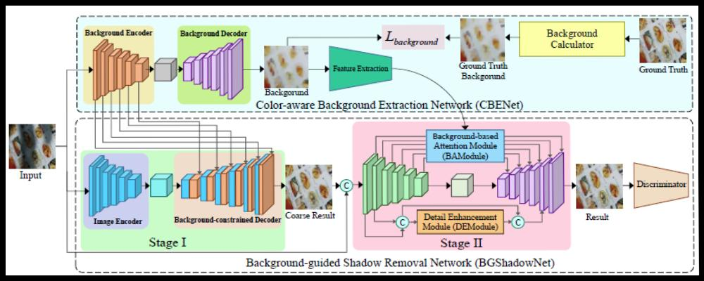

 

<strong>
Zheng Liu
</strong>

 
 

Associate Research Professor,

 

School of Computer Science,

 

China University of Geosciences (Wuhan),

 

<strong>Email</strong>：<a href="https://mail.google.com/mail/u/0/#inbox">liu.zheng.jojo@gmail.com</a>

# Latest News
- 2023.07: One paper is accepted by IEEE TVCG.
- 2023.04: One paper is accepted by CVPR.
- 2022.06: One paper is accepted by Computer & Graphics.
- 2021.11: One paper is accepted by Remote Sensing.
- 2021.06: One paper is accepted by IEEE TVCG, and another is conditionally accepted by Computer-Aided Design (SPM 2021).
- 2021.01: One paper is accepted by Sensors.
- 2020.12: One paper is accepted by Journal of Computer-Aided Design & Computer Graphics.
- 2020.11: One paper is accepted by Remote Sensing Letters.
- 2020.04: Two papers are accepted by Computer-Aided Design (SPM 2020).

# Research Interests

My research interests fall into the areas of computer graphics, image processing, scientific computing, and etc.
More specifically, I am interested in the following topics:
<ul>
<li>
Geometry Processing: Mesh denoising, Point cloud filtering/reconstruction, Registration, Mesh/Point cloud segmentation.
</li>
<li>
Image Processing: Image denoising, Image segmentation, Despeckling.
</li>
<li>
3D Deep Learning: Indoor scene detection/segmentation/labeling.
</li>
<li>
Numerical Optimization: Sparse optimization, Low rank optimization.
</li>
</ul>

# Professional Activites

<strong>
Paper reviewer
</strong>

: IEEE Transactions on Visualization and Computer Graphics (TVCG), IEEE Transactions on Multimedia (TMM), Computer-Aided Design (CAD), Computer Vision and Image Understanding, Computer Graphics Forum (CGF), Computer Aided Geometric Design (CAGD), Visual Computer, Computer & Graphics,IEEE Computer Graphics and Applications, Journal of Computational and Applied Mathematics (JCAM), IEEE Access

 

<strong>
Program committee
</strong>

: Chinagraph 2020; Geometric Modeling and Processing (GMP) 2021,2022,2023; GDC 2021,2022,2023;

# Selected Publications [[Google Scholar]](https://scholar.google.com/citations?user=_jtNrOUAAAAJ&hl=zh-CN) [[Researchgate]](https://www.researchgate.net/profile/Zheng_Liu52)

 
&nbsp;[21] **PCDNF: Revisiting Learning-based Point Cloud Denoising via Joint Normal Filtering**
 
&nbsp;Zheng Liu, Yaowu Zhao, Sijing Zhan, Yuanyuan Liu, **Renjie Chen**, Ying He
 
&nbsp;***IEEE Transactions on Visualization and Computer Graphics***, 2023.
 
&nbsp;**[[paper]](https://LabZhengLiu.github.io/papers/(CVPR23)Document Image Shadow Removal Guided by Color-Aware Background.pdf) 
   [[bib]](bibs/)**

 

 
&nbsp;[21] **Document Image Shadow Removal Guided by Color-Aware Background**
 
&nbsp;Ling Zhang, Yinghao He, Qing Zhang, **Zheng Liu**, Xiaolong Zhang, Chunxia Xiao
 
&nbsp;***Proceedings of the IEEE/CVF Conference on Computer Vision and Pattern Recognition (CVPR)***, 2023.
 
&nbsp;**[[paper]](https://LabZhengLiu.github.io/papers/(CVPR23)Document Image Shadow Removal Guided by Color-Aware Background.pdf) 
   [[bib]](bibs/)**

 

 
&nbsp;[20] **一种鲁棒的顾及RGB-D图像的刚性点云配准方法**
 
&nbsp;钟赛尚，李彦磊，**刘郑★**, 谢忠，陈建国，王伟明，刘秀平
 
&nbsp;***计算机辅助设计与图形学学报***, 2022.
 
&nbsp;**[[paper]](https://LabZhengLiu.github.io/papers/(CADCG22)顾及RGB-D图像的刚性点云鲁棒配准方法.pdf)
 [[bib]](bibs/)**

 

 
&nbsp;[19] **Feature-preserving Mumford-Shah mesh processing via nonsmooth nonconvex regularization**
 
&nbsp;Chunxue Wang, **Zheng Liu★**, Ligang Liu
 
&nbsp;***Computer & Graphics***, 2022.
 
&nbsp;**[[paper]](https://LabZhengLiu.github.io/papers/(CG22)Feature-preserving Mumford–Shah mesh processing via nonsmooth nonconvex regularization.pdf) 
   [[bib]](bibs/)**

 

 
&nbsp;[18] **A Robust Rigid Point Cloud Registration Method Considering RGB-D Images**
 
&nbsp;Saishang Zhong, Mingqiang Guo,  Ruina Lv, Jianguo Chen, Zhong Xie, **Zheng Liu★**
 
&nbsp;***Remote Sensing***, 2021.
 
&nbsp;**[[paper]](https://LabZhengLiu.github.io/papers/(RS21)A Robust Rigid Registration Framework of 3D Indoor Scene Point Clouds Based on RGB-D Information.pdf) 
   [[bib]](bibs/Zhong21ARobust.md)**

 

 
&nbsp;[17] **Shape-aware Mesh Normal Filtering**
 
&nbsp;Saishang Zhong, Zhenzhen Song, **Zheng Liu★**, Zhong Xie, Jianguo Chen, Lu Liu, Renjie Chen
 
&nbsp;***Computer-Aided Design (Proc. SPM)***, 2021.
 
&nbsp;**[[paper]](https://LabZhengLiu.github.io/papers/(CAD21)Shape-aware Mesh Normal Filtering.pdf) 
   [[bib]](bibs/Zhong2021Shape.md)**

 

 
&nbsp;[16] **Mesh Total Generalized Variation for Denoising**
 
&nbsp;**Zheng Liu**, Yanlei Li, Weina Wang, Ligang Liu, Renjie Chen★
 
&nbsp;***IEEE Transactions on Visualization and Computer Graphics***, 2021.
 
&nbsp;**[[paper]](https://LabZhengLiu.github.io/papers/(TVCG21)Mesh Total Generalized Variation for Denoising.pdf) 
   [[exe]](https://github.com/LabZhengLiu/MeshTGV)
   [[ppt]](papers/(PG21)MeshTGV.pptx)
   [[video]](papers/MeshTGV.mp4)
   [[bib]](bibs/Liu2021MeshTGV.md)**

 

 
&nbsp;[15] **Mesh Denoising via Adaptive Consistent Neighborhood**
 
&nbsp;Mingqiang Guo, Zhenzhen Song, Chengde Han, Saishang Zhong, Ruina Lv,  **Zheng Liu★**
 
&nbsp;***Sensors***, 2021.
 
&nbsp;**[[paper]](https://LabZhengLiu.github.io/papers/(Sensors21)Mesh%20Denoising%20via%20Adaptive%20Consistent%20Neighborhood.pdf) 
   [[bib]](bibs/Guo2021Mesh.md)**

 

 
&nbsp;[14] **A novel truncated nonconvex nonsmooth variational method for SAR image despeckling**
 
&nbsp;Mingqiang Guo, Chengde Han, Weina Wang, Saishang Zhong, Ruina Lv, **Zheng Liu★**
 
&nbsp;***Remote Sensing Letters***, 2020.
 
&nbsp;**[[paper]](https://LabZhengLiu.github.io/papers/(RSL20)A%20novel%20truncated%20nonconvex%20nonsmooth%20variational%20method%20for%20SAR%20image%20despeckling.pdf) 
   [[code]](https://github.com/ChengdeHan/TRTVp)
   [[bib]](bibs/Guo2020ANovel.md)**

 

 
&nbsp;[13] **Mesh Denoising via a Novel Mumford-Shah Framework**
 
&nbsp;**Zheng Liu**, Weina Wang, Saishang Zhong, Bohong Zeng, Jinqin Liu, Weiming &nbsp;Wang
 
&nbsp;***Computer-Aided Design (Proc. SPM)***, 2020.
 
&nbsp;**[[paper]](https://LabZhengLiu.github.io/papers/(CAD20)Mesh%20Denoising%20via%20a%20Novel%20Mumford–Shah%20Framework.pdf) 
    [[exe]](https://drive.google.com/file/d/1dy-IQ6D6D7uq1u_JcYSzhGvqdNgiAsqW/view?usp=sharing)
    [[bib]](bibs/Liu2020Mesh.md)**

 

 
&nbsp;[12] **A Feature-preserving Framework for Point Cloud Denoising**
 
&nbsp;**Zheng Liu**, Xiaowen Xiao, Saishang Zhong, Weina Wang, Yanlei Li, Ling &nbsp;Zhang, Zhong Xie
 
&nbsp;***Computer-Aided Design (Proc. SPM)***, 2020.
 
&nbsp;**[[paper]](https://LabZhengLiu.github.io/papers/(CAD20)A%20feature-preserving%20framework%20for%20point%20cloud%20denoising.pdf) 
    [[exe]](https://www.github.com)
    [[bib]](bibs/Liu2020AFeature.md)**

 

 
&nbsp;[11] **High Order Mesh Denoising via LP-L1 Minimization**
 
&nbsp;**Zheng Liu**, Mingqiang Guo, Zhong Xie, Jinqin Liu, Bohong Zeng
 
&nbsp;**IEEE ACCESS**, 2019.
 &nbsp;**[[paper]](https://LabZhengLiu.github.io/papers/(ACCESS19)High%20Order%20Mesh%20Denoising%20via%20LP-L1%20Minimization.pdf)
[[bib]](bibs/Liu2019High.md)**

 

 
&nbsp;[10] **A Novel Anisotropic Second Order Regularziation for Mesh Denoising**
 
&nbsp;**Zheng Liu**, Saishang Zhong, Zhong Xie, Weina Wang
 
&nbsp;***Computer Aided Geometric Design (Proc. GMP)***, 2019. 
 &nbsp;**[[paper]](https://LabZhengLiu.github.io/papers/(CAGD19)A%20Novel%20Anisotropic%20Second%20Order%20Regularization%20for%20Mesh%20Denoising.pdf) 
    [[exe]](https://drive.google.com/file/d/1dy-IQ6D6D7uq1u_JcYSzhGvqdNgiAsqW/view?usp=sharing)
    [[bib]](bibs/Liu2019ANovel.md)**

 

 
&nbsp;[9] **Robust Mesh Denoising via Triple Sparsity**
 
&nbsp;Saishang Zhong, Zhong Xie, Jinqin Liu, **Zheng Liu★**
 
&nbsp;***Sensors***, 2019.
 &nbsp;**[[paper]](https://LabZhengLiu.github.io/papers/(Sensors19)Robust%20Mesh%20Denoising%20via%20Triple%20Sparsity.pdf)
[[bib]](bibs/Zhong2019Robust.md)**

 

 
&nbsp;[8] **Triangulated Surface Denoising using High Order Regularization with Dynamic &nbsp;Weights**
 
&nbsp;**Zheng Liu**, Rongjie Lai, Huayan Zhang, Chunlin Wu
 
&nbsp;***SIAM Journal on Scientific Computing***, 2019.
 &nbsp;**[[paper]](https://LabZhengLiu.github.io/papers/(SISC19)Triangulated%20Surface%20Denoising%20using%20High%20Order%20Regularization%20with%20Dynamic%20Weights.pdf) 
    [[exe]](https://drive.google.com/file/d/1dy-IQ6D6D7uq1u_JcYSzhGvqdNgiAsqW/view?usp=sharing)
    [[bib]](bibs/Liu2019Triangulated.md)**

 

 
&nbsp;[7] **Mesh Denoising via Total Variation and Weighted Laplacian Regularizations**
 
&nbsp;Saishang Zhong, Zhong Xie, Weina Wang, **Zheng Liu★** and Ligang Liu
 
&nbsp;***Journal Computer Animation and Virtual Worlds (Proc. CASA)***, 2018.
 &nbsp;**[[paper]](https://LabZhengLiu.github.io/papers/(CASA18)Mesh%20denoising%20via%20total%20variation%20and%20weighted%20Laplacian%20regularizations.pdf) 
    [[exe]](https://www.github.com)
    [[bib]](bibs/Zhong2018Mesh.md)**

 

 
&nbsp;[6] **基于条件迭代更新随机森林的非约束人脸特征点精确定位**
 
&nbsp;刘袁缘, 谢忠, 周顺平, **刘郑★**, 王伟明, 刘秀平, 饶伟
 
&nbsp;***计算机辅助设计与图形学学报***, 2017.
 &nbsp;**[[paper]](https://LabZhengLiu.github.io/papers/(CADCG17)基于条件迭代更新随机森林的非约束人脸特征点精确定位.pdf)**

 

 
&nbsp;[5] **On Geodesic Curvature Flow with Level Set Formulation Over Triangulated &nbsp;Surfaces**
 
&nbsp;**Zheng Liu**, Huayan Zhang and Chunlin Wu
 
&nbsp;***Journal of Scientific Computing***, 2017.
 &nbsp;**[[paper]](https://github.com/LabZhengLiu/LabZhengLiu.github.io/blob/master/papers/(JSC16)On%20Geodesic%20Curvature%20Flow%20with%20Level%20Set%20Formulation%20Over%20Triangulated%20Surfaces.pdf)
[[bib]](bibs/liu2017geodesic.md)**

 

 
&nbsp;[4] **Illumination Decomposition for Photograph with Multiple Light Sources**
 
&nbsp;Ling Zhang, Qingan Yan, **Zheng Liu**, Hua Zou, Chunxia Xiao
 
&nbsp;***IEEE Transactions on Image Processing***, 2017. 
 &nbsp;**[[paper]](https://LabZhengLiu.github.io/papers/(TIP17)Illumination%20Decomposition%20for%20Photograph%20with%20Multiple%20Light%20Sources.pdf)**

 

 
&nbsp;[3] **A New Two-stage Mesh Surface Segmentation Method**
 
&nbsp;Huayan Zhang, Chunlin Wu, Jiansong Deng, **Zheng Liu**, Yuning Yang
 
&nbsp;***The Visual Computer***, 2017.
 &nbsp;**[[paper]](https://LabZhengLiu.github.io/papers/(JSC16)On%20Geodesic%20Curvature%20Flow%20with%20Level%20Set%20Formulation%20Over%20Triangulated%20Surfaces.pdf)**

 

 
&nbsp;[2] **As-rigid-as-possible Spherical Parametrization**
 
&nbsp;Chunxue Wang, **Zheng Liu★**, Ligang Liu
 
&nbsp;***Graphical Models (Proc. GMP)***, 2014.
 &nbsp;**[[paper]](https://LabZhengLiu.github.io/papers/(GMP14)As-Rigid-As-Possible%20Spherical%20Parametrization.pdf)**

 

 
&nbsp;[1] **Scale-Aware Shape Manipulation**
 
&nbsp;**Zheng Liu**, Weiming Wang, Xiuping Liu, Ligang Liu
 
&nbsp;***Journal of Zhejiang University Science C (Computers & Electronics)***, 2014.
 &nbsp;**[[paper]](https://LabZhengLiu.github.io/papers/(ZJUS14)Scale-aware%20shape%20manipulation.pdf)**

 

